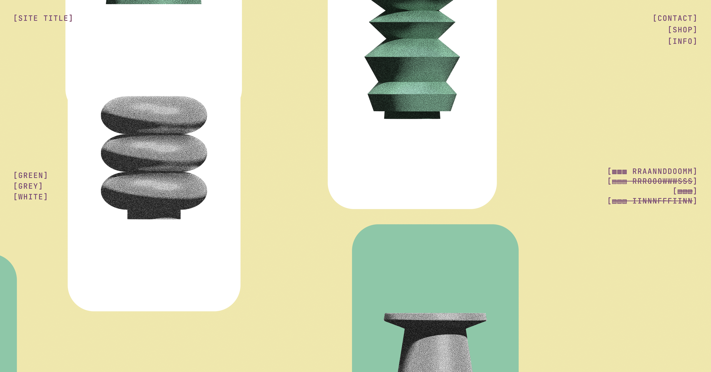
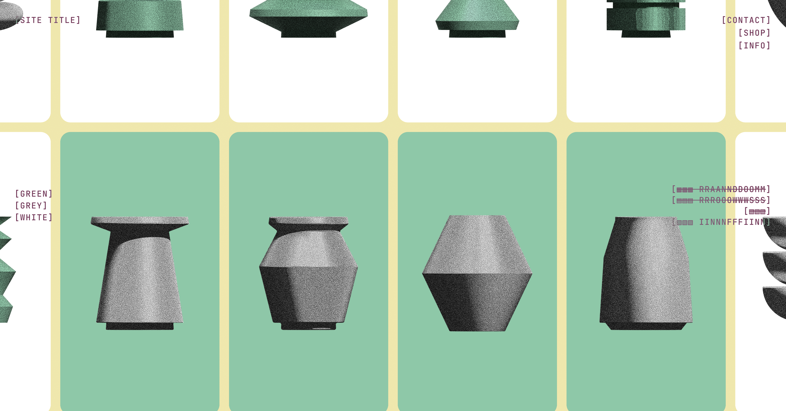
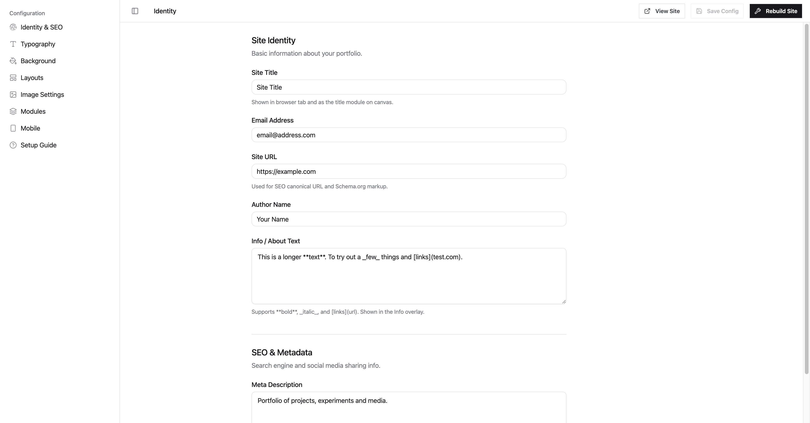

# Canvas Portfolio Template

A fully interactive, drag-and-drop portfolio website you can set up without touching a single line of code. Three moving parts:

1. **The Portfolio** — a static, vanilla HTML/CSS/JS canvas you deploy anywhere for free.
2. **The Setup GUI** — a local visual configurator that writes your settings to a config file. Think of it as a CMS that lives on your machine, not the cloud.
3. **The Live Demo** — an interactive preview hosted on GitHub Pages so you can try before you clone.

---

## See it live

The best way to understand this template is to play with it. We've deployed a live, interactive playground where you can test the **Setup GUI** and watch it update the **Portfolio Template** in real-time.

🔗 **[1. Open the Setup GUI](https://kostis-kounadis.github.io/canvas-portfolio-website-template/admin/)**  
🔗 **[2. Open the Portfolio Template](https://kostis-kounadis.github.io/canvas-portfolio-website-template/)**  

> [!TIP]  
> **Try this:** Open both links side-by-side using your browser's built-in Split View feature (supported by Edge, Arc, Safari, etc.) or just snap two windows together. Tweak a slider in the Setup GUI and watch the portfolio react instantly. *(Note: The demo is read-only so changes won't save permanently).*

🔗 **[kostiskounadis.xyz](https://kostiskounadis.xyz)** — see a real portfolio built with this template

---

## The Portfolio

A non-scrolling, pan-and-zoom canvas that you fill with your own images. Multiple layout modes (random scatter, rows, stacks, infinite grid), category filtering, custom typography, animated backgrounds, and full mobile support.

<table><tr><td></td><td></td></tr></table>

**Stack:** Zero dependencies. Vanilla HTML, CSS, and JavaScript. No framework, no build step, no node_modules. The output is a folder of static files.

---

## The Setup GUI

A local web app that lets you configure everything visually — site identity, typography, backgrounds, image effects, layout modes, modules, and mobile settings. Changes hot-reload into the portfolio preview instantly. When you're done, hit **Rebuild** to generate a fresh `data.js` from your images, then deploy.

<table><tr><td></td><td></td></tr></table>

**Stack:** React 19, Vite, Tailwind CSS, shadcn/ui, Zustand. Served locally by a lightweight Node.js server (no cloud, no accounts, no subscriptions).

---

## Quick Start

### Step 1 — Install Node.js

Node.js is needed to run the Setup GUI locally. You only need to do this once.

- **Mac:** Download from [nodejs.org](https://nodejs.org/) and run the installer.
- **Windows:** Download from [nodejs.org](https://nodejs.org/) and run the `.msi` installer. When asked, leave all default options as-is.

To check it worked, open Terminal (Mac) or Command Prompt (Windows) and type:

```
node --version
```

If you see a version number (e.g. `v22.0.0`), you're good.

---

### Step 2 — Get the template

Click the green **Code** button at the top of this page → **Download ZIP**. Unzip it somewhere on your computer.

Or if you use Git:

```bash
git clone https://github.com/kostis-kounadis/canvas-portfolio-website-template.git
```

---

### Step 3 — Add your images

Drop your images into the `template/assets/images/` folder. Organise them into subfolders — each subfolder becomes a category in your portfolio:

```
template/assets/images/
├── work/
│   ├── project-1.jpg
│   ├── project-2.jpg
│   └── videos.txt        ← (Optional) paste YouTube/Vimeo links here
├── personal/
│   └── vacation.jpg
└── experiments/
    └── sketch.png
```

Supported formats: `.jpg`, `.jpeg`, `.png`, `.webp`, `.avif`, `.gif`, `.mp4`
*(To add external YouTube or Vimeo embeds, simply create a text file named `videos.txt` inside any category folder and paste the video URLs inside it, one per line).*

---

### Step 4 — Launch the Setup GUI

**Automated (Double-click):**
- **Mac:** Double-click `start-setup.command`
  > If macOS blocks it, right-click → Open → Open anyway.
- **Windows / Linux:** Right-click `start-setup.sh` → Open with → Git Bash (or run `bash start-setup.sh` in any terminal)

**Manual (Terminal):**
If you prefer not to use the launcher scripts, simply open a terminal in the project folder and run:
```bash
npm install --prefix admin/build-setup-app
node admin/server/setup-server.js
```

Your browser will open at `http://localhost:3000/admin/` automatically.

---

### Step 5 — Configure your portfolio

Fill in your name, email, and links. Adjust typography, colors, and layout modes to your taste. The portfolio preview updates live on the left side.

When you're happy, click **Rebuild** (top-right corner of the GUI). This scans your images folder and generates the `data.js` file your portfolio uses.

---

### Step 6 — Deploy

Point any static host at the `template/` folder. Free options:

| Host | How |
|---|---|
| **Netlify** | Drag & drop the `template/` folder at [app.netlify.com](https://app.netlify.com) |
| **Vercel** | Import the repo, set **Root Directory** to `template` |
| **Cloudflare Pages** | Connect repo, set **Build output directory** to `template` |
| **GitHub Pages** | Upload contents of `template/` to your repo's `gh-pages` branch |

That's it. No server. No database. Just files.

---

## For Developers

If you want to modify the Setup GUI's source code:

```bash
cd admin/build-setup-app
npm install
npm run dev        # Start the Vite dev server (proxies API to port 3000)
npm run build      # Compile to admin/app/ (what the Node server actually serves)
```

The Node server (`admin/server/setup-server.js`) has no external dependencies — pure Node.js. It serves the compiled GUI, proxies the portfolio preview, and handles `config.json` reads/writes.

---

## Project structure

```
/
├── template/                   ← The portfolio website (deploy this)
│   ├── index.html
│   ├── main.js
│   ├── style.css
│   ├── config.json             ← Written by the Setup GUI
│   ├── data.js                 ← Generated by Rebuild
│   └── assets/images/          ← Your images go here
│
├── admin/
│   ├── app/                    ← Compiled Setup GUI (served by Node)
│   ├── server/                 ← Node.js backend (config read/write, image scan)
│   └── build-setup-app/        ← React source (for developers)
│
├── start-setup.command         ← Mac launcher
└── start-setup.sh              ← Windows / Linux launcher
```

---

*Built by a designer who loves automation, detests repetitive tasks, and has developed an unhealthy trust in large language models. Made with too much coffee and just enough spite.*
